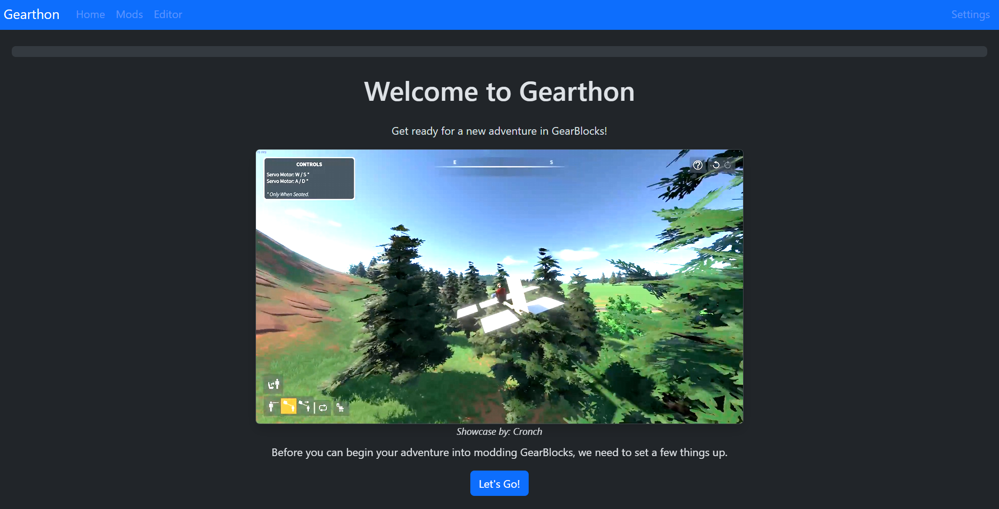

# Gearthon - GearBlocks Modding Simplified

## What Is This?
This tool provides a easy-to-use interface for both players and modders alike to mod the game. Players can install mods from modders into their mod folder and experience them in their game, just like that.

This tool utilizes GearLib to perform what it does. The setup process will automatically install all requirements for you! Simply download the latest release zip, extract it, launch the editor.exe, and follow the steps provided.

**Happy Modding!**

## Features
- Import OBJ models into the game
- All parts are unique, so share with your friends and the community!
- Create attachments for making unique builds ingame
- Develop custom logic on parts using Lua
- Add in-game tweakable options to give players customization for your scripted parts

**Please let me know of any issues via our Discord channel, or a DM!**